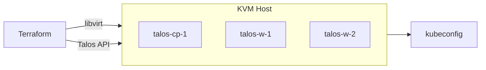

# k8s-deploy

[](https://github.com/jlambert229/k8s-deploy/actions)
[](https://github.com/jlambert229/k8s-deploy/commits/main)

<div align="center">

### Kubernetes on KVM, declarative

**Talos Linux** · **Terraform** · **Zero manual steps**

*From bare metal to `kubectl get nodes` in one apply.*

</div>

---



---

## What You Get

| Component | Description |
|-----------|-------------|
| **VMs** | CoW clones of the Talos disk image, one per node |
| **Networking** | Static IPs via cloud-init (no DHCP reservations) |
| **Talos** | Machine config applied via API (hostname, disk, optional VIP) |
| **Cluster** | Bootstrapped control plane, ready for workloads |
| **Access** | `kubeconfig` and `talosconfig` written to `generated/` |

> **Local or remote:** Run Terraform on the KVM host (`qemu:///system`) or from your workstation (`qemu+ssh`). Cloud-init ISOs adapt automatically.

---

## Quick Start

### Prerequisites

- KVM host: `qemu-kvm`, `libvirt-daemon-system`, `virtinst`, `cloud-image-utils`, `ovmf`
- Bridge interface (e.g. `br0`), storage pool, Terraform ≥ 1.5

### 1. Image

```bash
tfinit
tfa -target=talos_image_factory_schematic.this  # Creates schematic, enables output
```

Then on the KVM host (or locally if Terraform runs there):

```bash
wget -O- "$(terraform output -raw talos_image_url)" | xz -d > /var/lib/libvirt/images/talos-nocloud.raw
```

### 2. Configure

```bash
cp terraform.tfvars.example terraform.tfvars
```

Edit at minimum: `talos_image_path`, `network_cidr`, `gateway`, and `libvirt_uri`.

### 3. Deploy

```bash
tfinit && tfp && tfa
```

Terraform creates VMs, applies Talos config, bootstraps, runs health check, and writes `generated/kubeconfig`.

### 4. Use

```bash
export KUBECONFIG=$(pwd)/generated/kubeconfig
kubectl get nodes
```

### How It Works

VMs boot from a Talos disk image with a cloud-init ISO attached. Talos reads the static network config on first boot, then Terraform connects to the Talos API and applies the full machine config.

> No DHCP. No manual wiring. IPs are deterministic from `network_cidr` and offsets.

---

## Documentation

| Doc | Contents |
|-----|----------|
| [**Architecture**](docs/architecture.md) | Flow, components, IP assignment, HA |
| [**Configuration**](docs/configuration.md) | Full variable reference |
| [**Operations**](docs/operations.md) | Upgrades, NFS, troubleshooting, destroy |

---

## Key Variables

| Variable | Purpose |
|----------|---------|
| `libvirt_uri` | `qemu:///system` (local) or `qemu+ssh://user@host/system` (remote) |
| `talos_image_path` | Path to Talos disk image on the KVM host |
| `network_cidr`, `gateway` | Network configuration |
| `controlplane_count`, `worker_count` | Cluster size |
| `cluster_vip` | Virtual IP for HA (use with 3 CP nodes) |
| `nfs_server` | Enable NFS CSI + StorageClass (optional) |

---

## Project Layout

```
k8s-deploy/
├── main.tf              # VMs, cloud-init ISOs
├── talos.tf             # Secrets, bootstrap, health, kubeconfig
├── storage.tf           # NFS CSI (optional)
├── cloud-init/          # user-data, meta-data, network-config templates
├── scripts/             # create-cloudinit-iso.sh
├── docs/                # Architecture, configuration, operations
└── generated/           # kubeconfig, talosconfig (gitignored)
```

---

## Dependencies

| Project | Role |
|---------|------|
| [Talos Linux](https://www.talos.dev/) | Immutable Kubernetes OS |
| [terraform-libvirt](https://github.com/jlambert229/terraform-libvirt) | VM provisioning |
| [Talos Terraform Provider](https://registry.terraform.io/providers/siderolabs/talos/latest) | Cluster orchestration |

---

*Built for homelabs and edge. Feedback welcome.*
