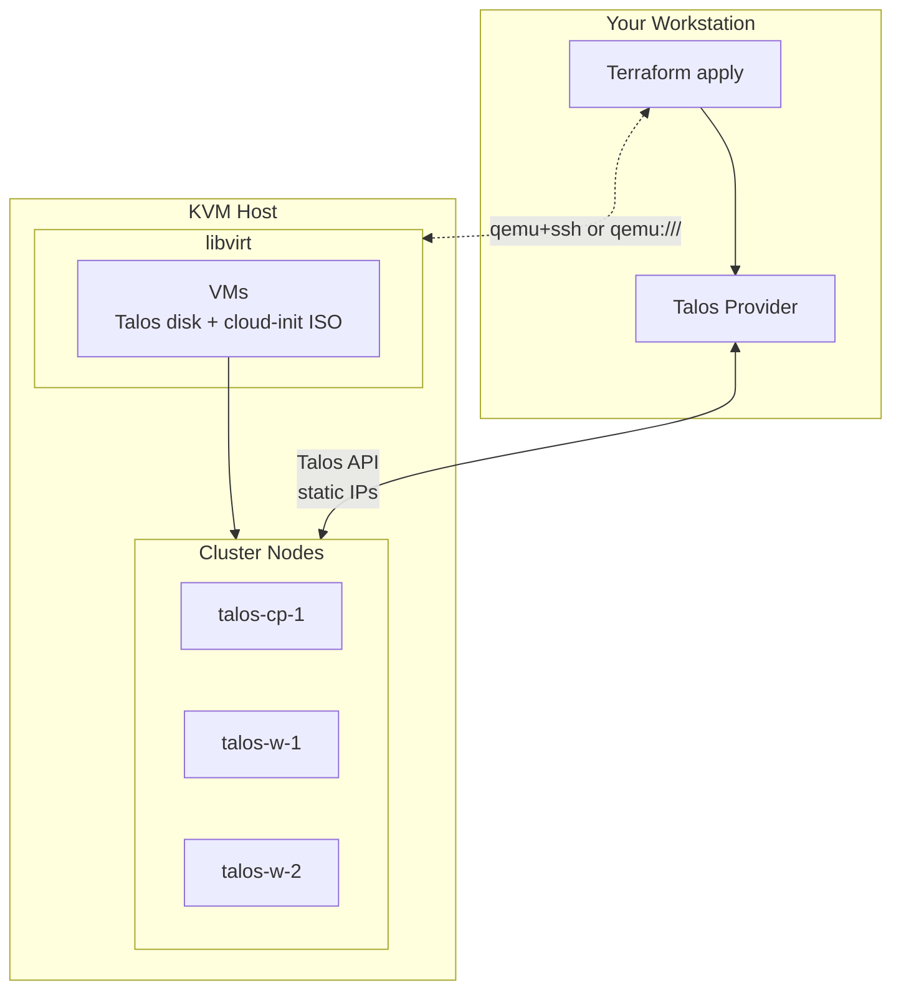
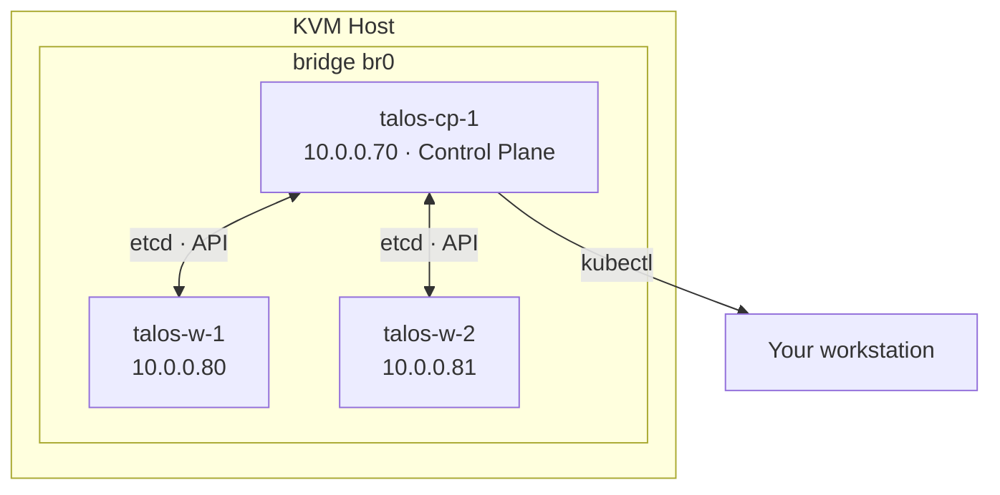
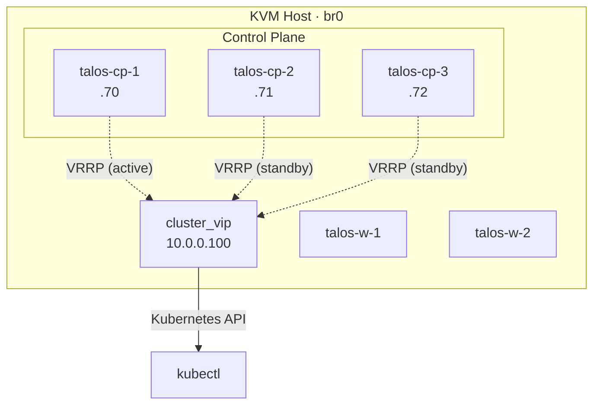
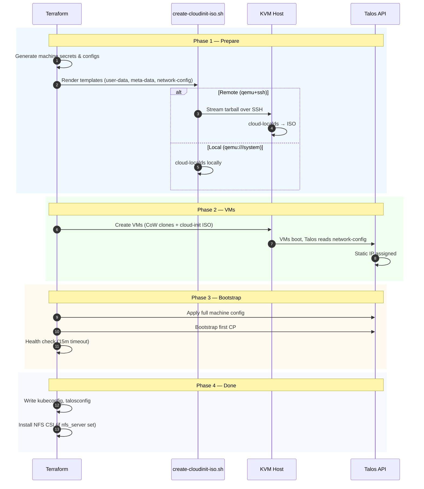
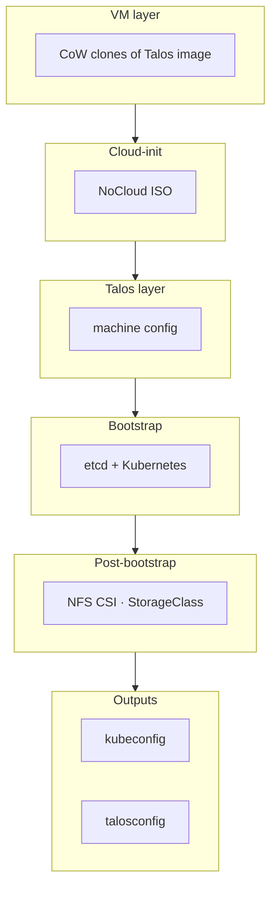
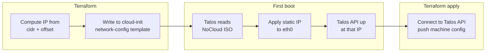

# Architecture

How k8s-deploy creates a Talos Kubernetes cluster on libvirt/KVM. From Terraform config to a ready Kubernetes API in one apply.

→ [Configuration reference](configuration.md) · [Operations](operations.md) · [README](../README.md)

---

## Overview



## Cluster Topology

*Default: 1 control plane, 2 workers. All nodes on the host bridge.*



*HA: 3 control planes + VIP. One CP holds the floating VIP via VRRP.*

---



## Deploy Flow



## Component Stack



| Layer | What | Where |
|-------|-----|-------|
| **VMs** | QEMU/KVM domains, CoW clones of Talos image | KVM host |
| **Cloud-init** | NoCloud ISO with static network config | Attached as CDROM |
| **Talos** | Machine config (hostname, disk, VIP) applied via API | Each node |
| **Bootstrap** | etcd + Kubernetes control plane init | First CP only |
| **Post-bootstrap** | Kubeconfig, NFS CSI (optional) | Terraform outputs + kube-system |

## IP Assignment

VMs get **deterministic** IPs—no DHCP reservations.



| Step | What |
|------|------|
| **MAC** | `52:54:00:c1:00:01` (CP), `52:54:00:c2:00:01` (workers) |
| **Cloud-init** | NoCloud datasource provides `network-config` with static address |
| **Talos** | Reads cloud-init on first boot, applies IP before API comes up |
| **Terraform** | Connects to Talos API at that IP to push full config |

```
network_cidr: 10.0.0.0/24
cp_ip_offset: 70      → 10.0.0.70, 10.0.0.71, ...
worker_ip_offset: 80  → 10.0.0.80, 10.0.0.81, ...
```

## HA with VIP

When `cluster_vip` is set and you have 3 control plane nodes (see topology diagram above):

- Talos uses **VRRP** to hold a floating Virtual IP
- One CP node owns the VIP; on failure it migrates to a healthy peer
- `cluster_endpoint` points at the VIP so the API is always reachable

> **Best practice:** Use `controlplane_count = 3` with `cluster_vip` for production-like setups.

## File Layout

```
k8s-deploy/
├── main.tf           # Cloud-init ISOs, VMs
├── talos.tf          # Secrets, configs, bootstrap, health, kubeconfig
├── storage.tf       # NFS CSI (optional)
├── image.tf          # Talos image factory (schematic, URL)
├── locals.tf         # Node defs, cloud-init content, libvirt SSH
├── cloud-init/       # Templates: user-data, meta-data, network-config
├── scripts/
│   └── create-cloudinit-iso.sh   # Builds ISO (local or remote)
└── generated/       # kubeconfig, talosconfig (gitignored)
```
