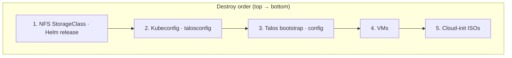

# Operations

→ [Architecture](architecture.md) · [Configuration](configuration.md) · [README](../README.md)

Day-two tasks: upgrades, health checks, NFS CSI, secrets, and teardown.

---

## Upgrading Talos


1. Update `talos_version` in tfvars.
2. Get the new image URL:
   ```bash
   terraform output -raw talos_image_url
   ```
3. Download and decompress on the KVM host:
   ```bash
   wget -O- "$(terraform output -raw talos_image_url)" | xz -d > /var/lib/libvirt/images/talos-v1.x.x-nocloud.raw
   ```
4. Update `talos_image_path` if the path changed.
5. Apply:
   ```bash
   terraform apply
   ```
6. Upgrade nodes (after apply):
   ```bash
   export TALOSCONFIG=$(pwd)/generated/talosconfig
   talosctl upgrade --image <new-image> --preserve
   ```

> **Note:** The schematic ID (`terraform output talos_schematic_id`) is used when building custom images with extensions such as qemu-guest-agent.

---

## Health Check Timeout

If the health check times out (e.g. qemu-guest-agent keeps nodes in "booting"):

1. Set `talos_extensions = []` to remove the extension.
2. Rebuild the image (new schematic) and update `talos_image_path`.
3. Apply.

Alternatively, add a virtio-serial channel to the VM module so qemu-guest-agent can communicate.

---

## NFS CSI

When `nfs_server` is set, Terraform installs:

- **csi-driver-nfs** Helm chart (kube-system)
- **nfs-appdata** StorageClass (server/share from variables)

Each PVC gets a subdirectory under the NFS share. Compatible with [k8s-media-stack](https://github.com/jlambert229/k8s-media-stack).

---

## Regenerating Secrets

To rotate Talos machine secrets (loses cluster access until re-bootstrap):

1. Remove `talos_machine_secrets.this` from state:
   ```bash
   terraform state rm talos_machine_secrets.this
   ```
2. Apply. New secrets are generated; you must re-bootstrap (destructive).

> **Warning:** Only do this if you understand the impact. Existing clusters will need full re-provisioning.

---

## Destroy Order



The destroy provisioner cleans cloud-init ISOs on the remote host when using `qemu+ssh`.

> **Tip:** Ensure `libvirt_uri` matches the connection used during create so the destroy provisioner can SSH when needed.
